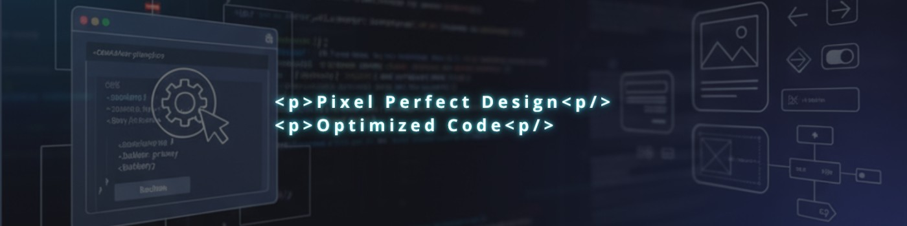

  

  

    
  

    

    
    <h1>Hi, I'm Claudia Machado! 👋</h1>
   
Dedication, passion, and learning are what keep me moving. 

     

  

    

 

---

 

## 🔭 About Me

My approach combines technical rigor with design sensibility—spanning everything from information architecture to production deployment, including RESTful API integration, CI/CD management, and performance optimization. Working with React 19, Next.js, Node.js, Laravel, and PostgreSQL allows me to collaborate across the full stack and deliver seamless, end-to-end solutions.

My mission is to design solutions that don’t just meet today’s demands, but are future-proofed to sustain product growth and the evolution of the user experience. I am driven by complex challenges that require technical precision and the rigorous application of SEO, accessibility, and performance best practices to deliver tangible business value. 

* 📍 Location: Aveiro - Portugal
* 💼 Currently working as: Front-End Developer and Prompt Engineer
* 🌱 Currently learning/focused on: AI Enginner
* 💡 I like to talk about: Music, movies, and travel
* 🤝 Looking to collaborate on: Design and Front-End development projects, especially those involving AI, to apply and expand my skills.
 

## 🛠️ My Technology Stack

Here are the main tools and technologies I use:

    <h3>Languages</h3>
    

        
        
        
        
    

    <h3>Frameworks and Libraries</h3>
    

        
        
        
    

    <h3>Tools</h3>
    

        
                    
        
        
        
        
        
    

 

---

 

## 🔗 Get in Touch

I am always open to new connections and opportunities. Feel free to contact me:

    

        
        
    

    

