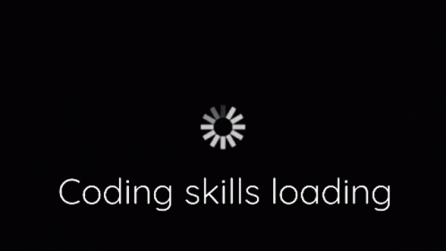

    

    
    <h1>Hi, I'm Claudia Machado! 👋</h1>
    
🚀 UI/UX Designer | Junior Front-End Developer | WordPress Specialist 

    

 

---

 

## 🔭 About Me

UX/UI Designer and Junior Front-End Developer passionate about transforming ideas into intuitive and accessible digital products. My journey covers the complete development cycle, from Research and Experience Planning (UX) to Front-End Implementation, with solid experience in projects built using WordPress. 
Dedication, passion, and learning are what keep me moving.

* 📍 Location: Aveiro - Portugal
* 💼 Currently working as: Freelancer
* 🌱 Currently learning/focused on: Front-End development
* 💡 I like to talk about: Music, movies, and travel
* 🤝 Looking to collaborate on: Design and Front-End development projects, especially those involving React, to apply and expand my new skills.
 

## 🛠️ My Technology Stack

Here are the main tools and technologies I use:

    <h3>Languages</h3>
    

        
        
        
    

    <h3>Frameworks and Libraries</h3>
    

        
        
        
    

    <h3>Tools</h3>
    

        
                    
        
        
        
        
        
    

 

---

 

## 🔥 GitHub Activity

       

 

---

 

## 🔗 Get in Touch

I am always open to new connections and opportunities. Feel free to contact me:

    

        
        
    

    

